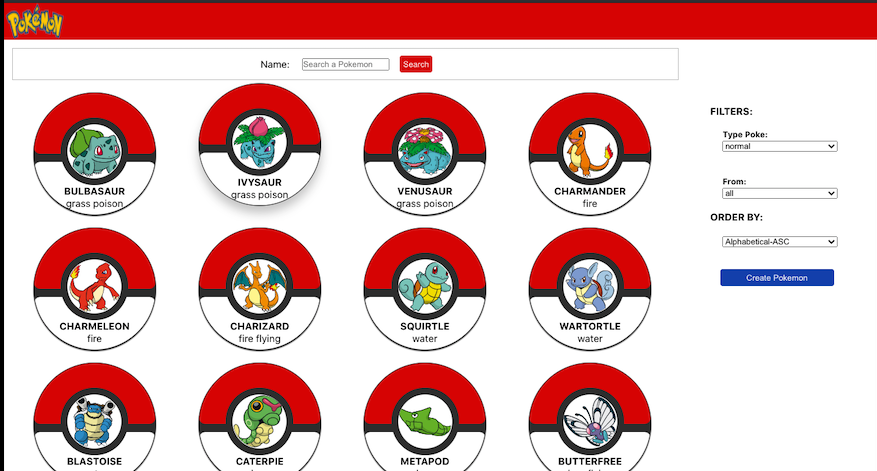

```js
const  Seba  =  {
  _aboutMe: "Entusiasta, proactivo y detallista. Siempre dispuesto a aprender y enseñar.
              Orientado al Frontend.",
  techSkills: [ Javascript ,  Html ,  Css, React ,  Redux , MaterialUI, Node] , 
  softSkills: [ TeamWork, Srum, Autodidact ] , 
 challenge: "Estoy en la etapa final del bootcamp de #Henry, mi primer proyecto grupal " 
}

const proyect = problem =>  solution;

const future = new Proyect(['React Native', 'UX/UI']);

```
<hr>
<h3>My favorite tools:</h3>
<hr>
<h3>Proyects:</h3>
<p>POKEAPI - Proyecto Individual</p>


<p>INTEGRA - Proyecto Grupal</p>

<hr>
<h3>You can find me:</h3>

 [](https://www.linkedin.com/in/sebastiansanchezisame/)

 [](mailto:sebastian.sanchezisame@outlook.com)
 
  


<!--
**SebaSanchezI/SebaSanchezI** is a ✨ _special_ ✨ repository because its `README.md` (this file) appears on your GitHub profile.

Here are some ideas to get you started:

- 🔭 I’m currently working on ...
- 🌱 I’m currently learning ...
- 🤔 I’m looking for help with ...
- 💬 Ask me about ...
- 📫 How to reach me: ...
- 😄 Pronouns: ...
- ⚡ Fun fact: ...
-->
