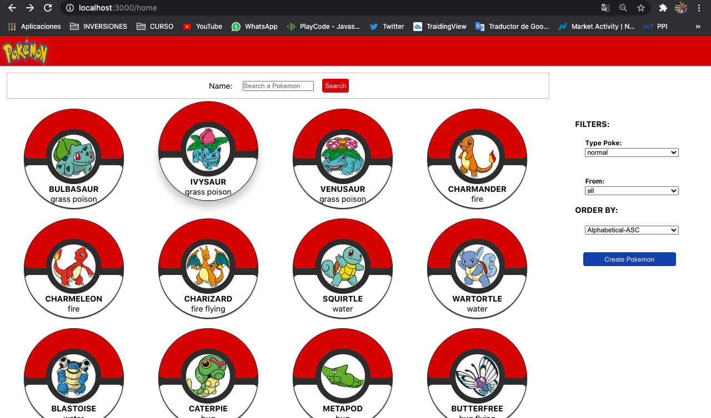

```js
const  Seba  =  {
  _aboutMe: "Enthusiastic, proactive and detailed. Always ready to learn and teach.
             Frontend oriented.",
  techSkills: [ Javascript ,  Html ,  Css, React ,  Redux , MaterialUI, Node] , 
  softSkills: [ TeamWork, Scrum, Autodidact ] , 
 challenge: "I'm in the final stage of the #Henry bootcamp, my first group project. " 
}

const objetive = problem =>  solution;

const future = new Project(['React Native', 'UX/UI']);

```
<hr>
<h3><a href="https://sebasanchezi.github.io/" target="_blank" >PORTFOLIO</a></h3>
<hr>
<h3>Proyects:</h3>
<p>POKEAPI - Individual Project</p>


<p><a href='https://integra-platform.web.app/'>INTEGRA<a/>-Group Project</p>
<a href='https://integra-platform.web.app/'><a/>
<hr>
<h3>You can find me in:</h3>

 [](https://www.linkedin.com/in/sebastiansanchezisame/)
 [](https://wa.me/5493424097403)
 [](mailto:sebastian.sanchezisame@outlook.com)
 
  


<!--
